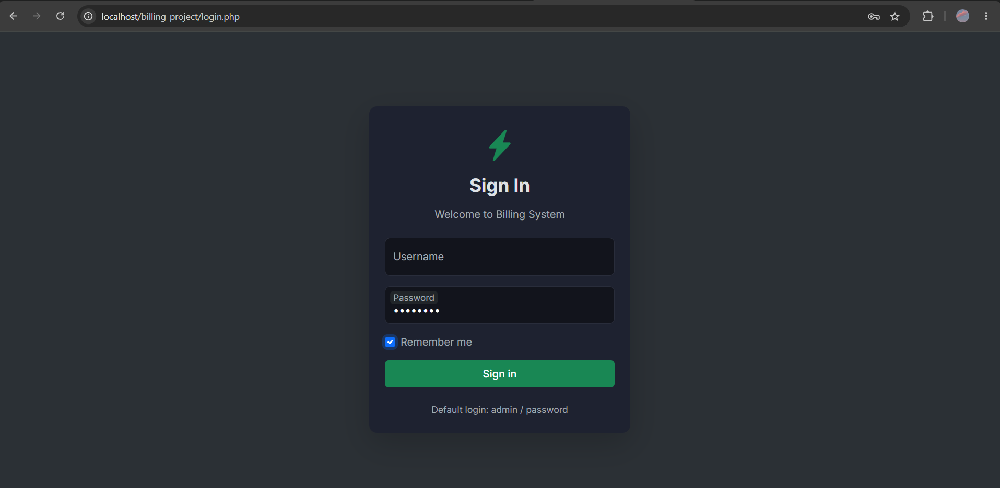
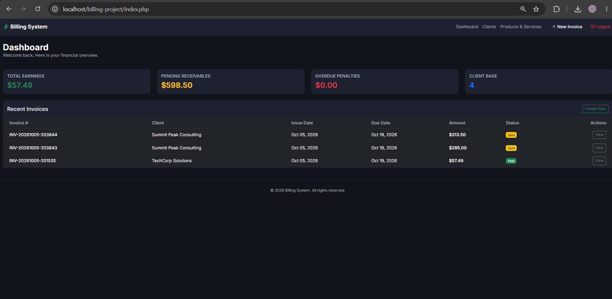
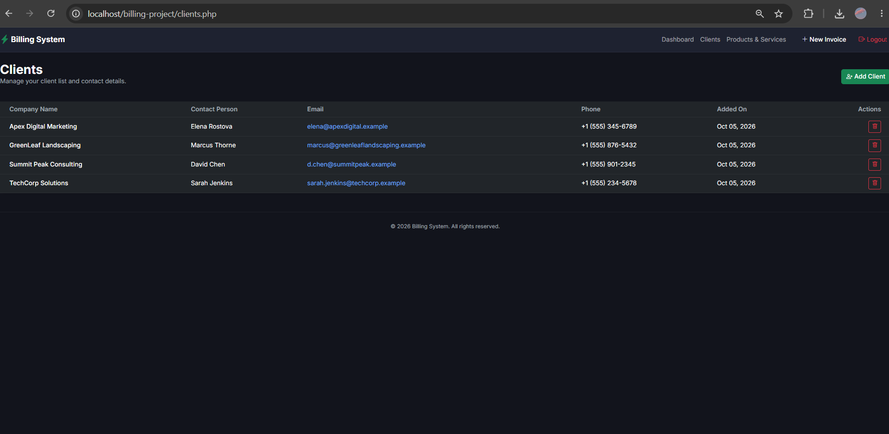
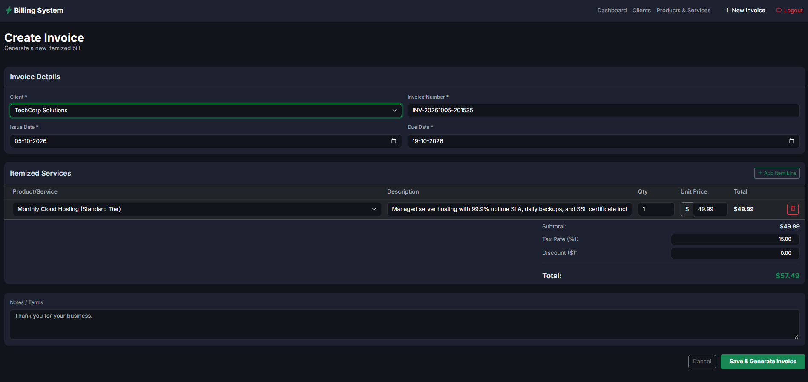
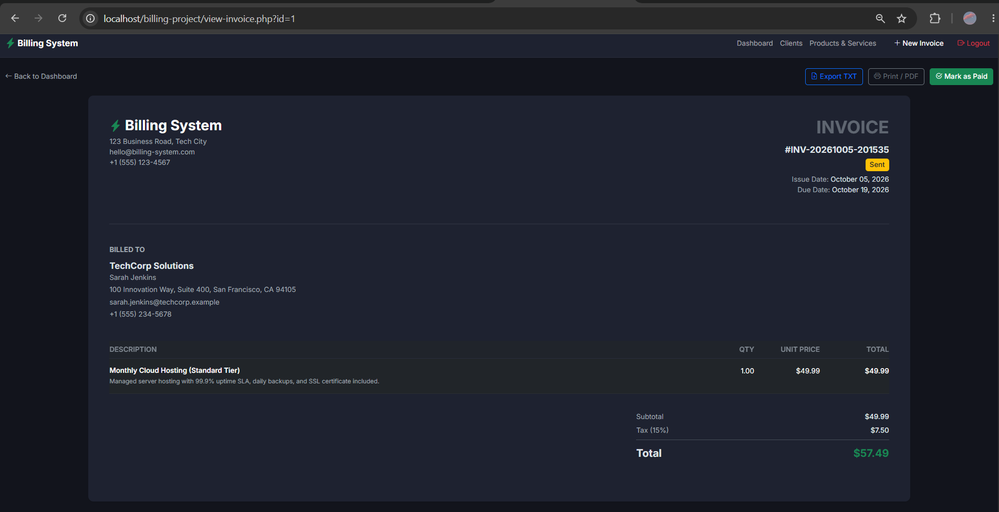
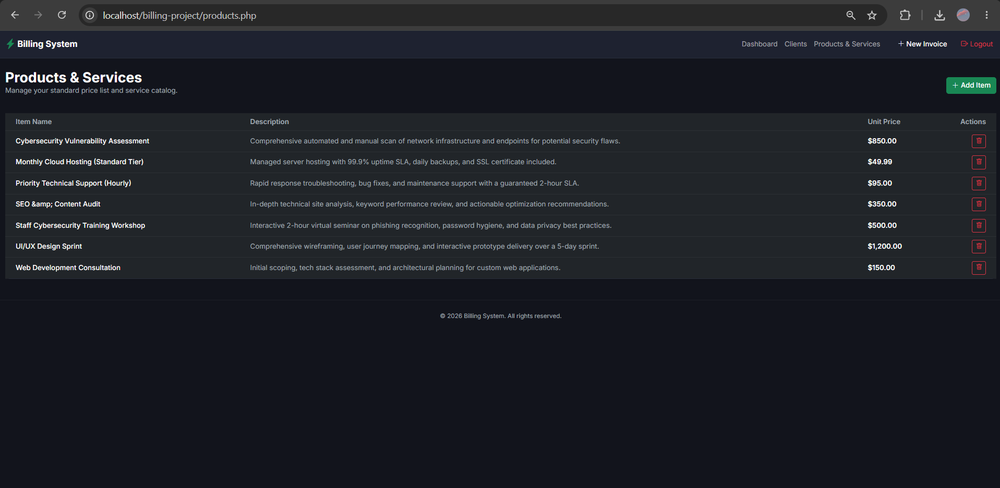

# Small Business Billing System

> A lightweight, professional billing and invoicing web application built for freelancers, independent contractors, and small agencies — without any PHP frameworks.


---

## 📸 Screenshots

> *(Paste your screenshots here — see the [Screenshots Guide](#screenshots-guide) below)*

| Login Page | Dashboard |
|---|---|
|  |  |

| Clients | Create Invoice |
|---|---|
|  |  |

| Invoice View | Products |
|---|---|
|  |  |

---

## 🚀 Features

| Requirement | Implementation |
|---|---|
| **PHP Programming** | Native PHP 8, procedural + OOP (PDO) |
| **Functions** | Custom helper functions in `config/functions.php` (`sanitize`, `format_currency`, `set_flash_message`, `display_flash`) |
| **Arrays** | Associative arrays used throughout for database rows, form data, and invoice items |
| **Forms** | Add Client, Add Product, Create Invoice, Login — all with server-side validation |
| **Sessions** | Login state stored in `$_SESSION`, flash messages for user feedback |
| **Cookies** | "Remember Me" on login page sets a 30-day persistent cookie |
| **File Handling** | Export invoice to `.txt` using `fopen()`, `fwrite()`, `fclose()` |
| **Database Connectivity** | Secure PDO connection with `ERRMODE_EXCEPTION` |
| **CRUD Operations** | Full Create, Read, Update, Delete on Clients, Products, and Invoices |
| **Login & Authentication** | Protected routes via `includes/auth.php`, `password_verify()`, session + cookie auth |
| **Form Validation** | Client-side HTML5 `required`, server-side null/empty checks, date invariant check (due ≥ issue) |

---

## 🛠️ Tech Stack

- **Backend:** PHP 8 (Native, no frameworks)
- **Database:** MySQL / MariaDB via PDO with prepared statements
- **Frontend:** Bootstrap 5.3, Bootstrap Icons, Vanilla JavaScript
- **Typography:** Inter (Google Fonts)
- **Environment:** XAMPP (Apache + MySQL)

---

## 📂 Project Structure

```
billing-project/
│
├── config/
│   ├── database.php        # PDO connection wrapper
│   └── functions.php       # Custom helper functions (sanitize, flash messages, currency)
│
├── includes/
│   ├── auth.php            # Session/cookie authentication middleware
│   ├── header.php          # Global navbar, Bootstrap CDN, CSS links
│   └── footer.php          # Copyright footer, Bootstrap JS
│
├── modules/                # Backend form processors
│   ├── save-client.php
│   ├── save-product.php
│   ├── process-invoice.php # PDO transaction: insert invoice + line items
│   ├── delete-client.php
│   ├── delete-product.php
│   └── export-invoice.php  # File handling: write .txt receipt and download
│
├── assets/
│   ├── css/custom.css      # Dark mode theme: Slate & Emerald palette
│   └── js/                 # (Reserved)
│
├── exports/                # Auto-generated .txt invoice exports (gitignored)
│
├── index.php               # Dashboard: metrics + recent invoices
├── login.php               # Login form with Remember Me (Cookie)
├── logout.php              # Session destroy + cookie clear
├── clients.php             # Client list + Add modal (CRUD)
├── products.php            # Product/Service catalog (CRUD)
├── create-invoice.php      # Dynamic invoice builder (Vanilla JS row appender)
├── view-invoice.php        # Printable invoice view + TXT export
└── schema.sql              # Full database schema + default admin user
```

---

## ⚙️ Installation & Setup

### Prerequisites
- [XAMPP](https://www.apachefriends.org/) (or any Apache + MySQL + PHP stack)

### Steps

**1. Clone the repository**
```bash
git clone https://github.com/YOUR_USERNAME/billing-project.git
```

**2. Start XAMPP**
- Open the XAMPP Control Panel
- Start **Apache** and **MySQL**

**3. Import the database**
- Open [phpMyAdmin](http://localhost/phpmyadmin)
- Create a new database called `billing_system`
- Click **Import** and select `schema.sql` from the project root
- Click **Go**

**4. Configure the database connection**

Open `config/database.php` and verify:
```php
$host = '127.0.0.1';
$db   = 'billing_system';
$user = 'root';
$pass = ''; // update if you have a password
```

**5. Important note**

Open the installer: [http://localhost/billing-project/install.php](http://localhost/billing-project/install.php). Follow any messages it displays.
f. Confirm the database tables were created in phpMyAdmin, then open [http://localhost/billing-project/](http://localhost/billing-project/).

*If the `users` table is missing*

If login reports that `billing_system.users` does not exist, the database setup has not completed. Run the installer again. If it does not create the tables, select `billing_system` in phpMyAdmin, choose **Import**, and import the project's `schema.sql` file.

Use the login credentials provided by the installer or documented in the project. Do not commit real database passwords or other secrets.

**6. Launch the application**

Open your browser and go to:
```
http://localhost/billing-project/
```

---

## 🔐 Default Login

| Field | Value |
|---|---|
| Username | `admin` |
| Password | `password` |

> You can change the admin password by updating the `password_hash` in the `users` table via phpMyAdmin using PHP's `password_hash('yourpassword', PASSWORD_BCRYPT)`.

---

## 🗄️ Database Schema

```
billswift_db (billing_system)
│
├── users            → Admin authentication accounts
├── clients          → Client contact and billing information
├── products_services → Standard price list / service catalog
├── invoices         → Master invoice records (status, totals, tax, discount)
└── invoice_items    → Line items (snapshot of product at billing time)
```
---

## 📋 PHP Requirements Coverage

### ✅ Sessions
- `$_SESSION['user_id']` and `$_SESSION['username']` set on login (`login.php`)
- `set_flash_message()` stores temporary UI notifications in the session (`config/functions.php`)
- Session destroyed on logout (`logout.php`)

### ✅ Cookies
- "Remember Me" checkbox on login page sets `remember_user` cookie for 30 days (`login.php`)
- `auth.php` reads the cookie to auto-authenticate returning users
- Cookie cleared on logout (`logout.php`)

### ✅ File Handling
- `modules/export-invoice.php` uses `fopen()`, `fwrite()`, and `fclose()` to write a `.txt` receipt to the `exports/` directory
- File is streamed to the browser as a download via appropriate HTTP headers

### ✅ Form Validation
- **Client-side:** HTML5 `required`, `type="email"`, `min` attributes
- **Server-side:** `sanitize()` function strips tags and encodes output; empty field checks; date invariant (`due_date >= issue_date`); quantity > 0 check in invoice processing

---

## 🖨️ Print / PDF Invoice

Navigate to any invoice → click **Print / PDF**.

A `@media print` CSS block hides all navigation and converts the dark-mode interface to a clean, high-contrast white document — ready to save as a PDF from your browser's print dialog.

---

## 👤 Author

**[Am-I-Sun]**
- GitHub: [@Am-I-Sun](https://github.com/Am-I-Sun)

---

## 📄 License

This project is for academic/portfolio use.
